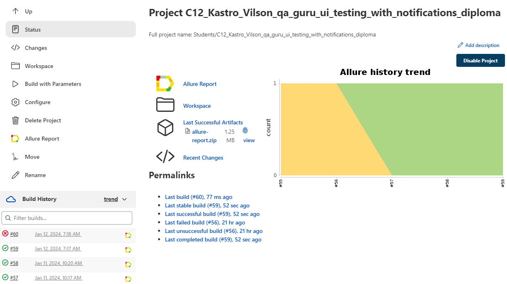
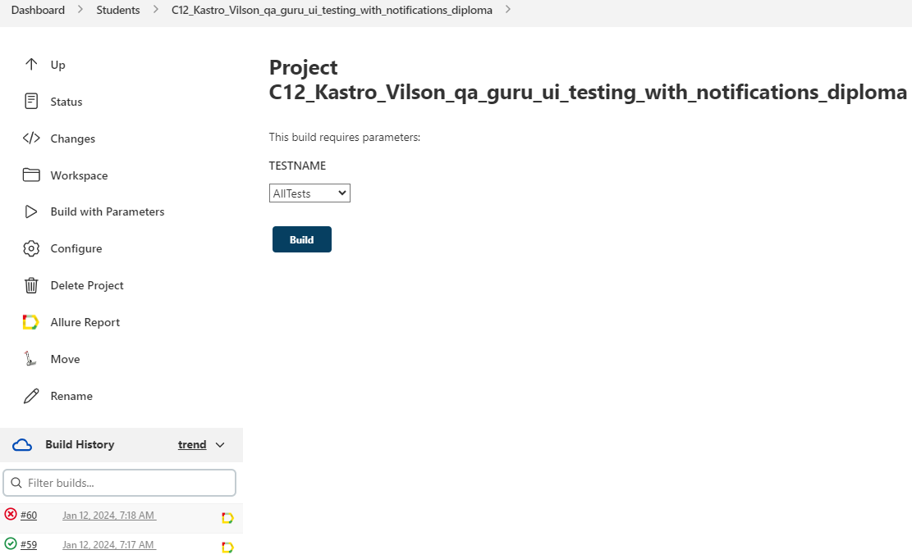
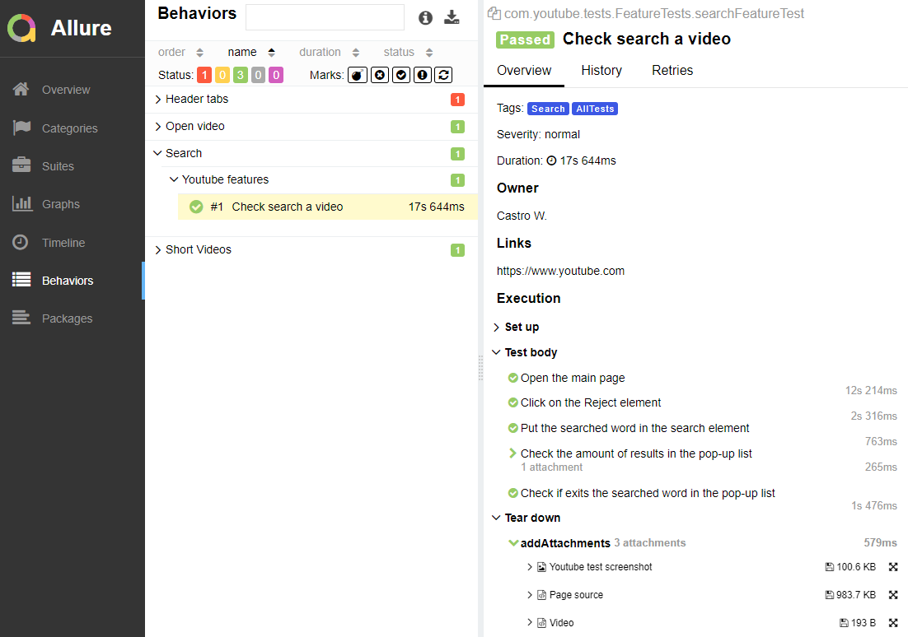
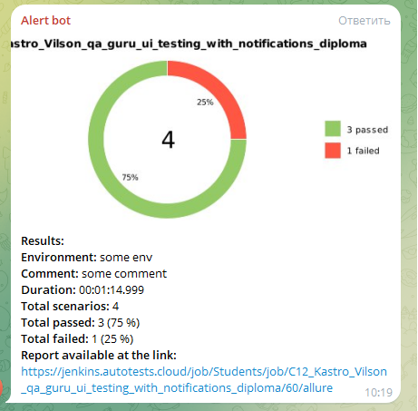

# Project to automate UI testing of the youtube.com site

Site for testing [youtube.com](https://www.youtube.com)

## Content

* <a href="#link-technologies-and-tools">Technologies and tools</a>
* <a href="#link-implemented-tests">Implemented tests</a>
* <a href="#link-starting-test">Starting test </a>

## Technologies and tools

<p align="center">


</p>

In this project, autotests are written in Java using Selenide for UI tests.

JUnit 5 is used as a unit testing library.

Gradle is used to build the project automatically.

Selenide is used for interaction with UI.

Selenoid launches browsers in Docker containers.

Allure Report generates a test run report.

Jenkins is running tests.

After the run is completed, notifications are sent using the bot in Telegram.

## Implemented tests
- [x] Testing the Search functionality and checking for existence of results
- [x] Testing the functionality of opening a video and checking the existence of its properties such as the title and others
- [x] Testing that the Short Videos icon forwards to the correct page and yours existences
- [x] Checking for the existence of tags in the Header tabs

## Starting test 
<details>
<summary>Starting test from Idea console</summary>

### Starting tests Locally

* ```gradle clean test -DtestTag=${TAGTEST} -DLauncher=Local allureServe```
* ```gradle clean test -DtestTag=AllTest -DLauncher=Local allureServe```

### Starting tests remotely in Selenoid
* ```gradle clean test -DtestTag=${TAGTEST} -DLauncher=Remote allureServe```
</details>

###  Starting tests from [Jenkins](https://jenkins.autotests.cloud/job/Students/job/C12_Kastro_Vilson_qa_guru_ui_testing_with_notifications_diploma/)
#### After setting up the project in Jenkins and clicking on the “Build with parameters” button, select the needed test name and click on Build button, then the tests will begin to be assembled and run through the virtual machine in Selenoid.

<p></p>

<p></p>

#### After passing the tests, the result is displayed in Allure Report

##  Example of [Allure Report](https://jenkins.autotests.cloud/job/Students/job/C12_Kastro_Vilson_qa_guru_ui_testing_with_notifications_diploma/60/allure/#behaviors/28eaa749046249292ad126338a89aa0a/48fd01b774fc9977/)

## Allure report for each UI test includes a screenshot, log, html page and a video of the test being passing

<p></p>

## Example of Telegram report

<p></p>

### Please don't forget click on Star button ;)
